# 🧬 Spatial Transcriptomics Analysis — 10x Genomics Visium & Xenium

[](https://colab.research.google.com)
[](https://www.python.org)
[](https://scanpy.readthedocs.io)
[](https://squidpy.readthedocs.io)
[](LICENSE)

**Author:** Faiqa Zarar  
**Institution:** NUST — National University of Sciences and Technology  
**Course:** Bioinformatics  
**Date:** April 2026

---

## 📖 Overview

Spatial transcriptomics technologies allow gene expression to be measured **while preserving the physical location** of each measurement in the tissue. This repository contains four fully documented analysis notebooks covering two major 10x Genomics spatial platforms — **Visium** and **Xenium** — using the **Scanpy** and **Squidpy** ecosystems.

Each notebook contains detailed markdown explanations before every code block, covering:
- The **biological rationale** behind each step
- What the **code does** to the data
- How to **interpret the outputs**

---

## 🔬 Technology Overview

| Platform | Resolution | Method | Output |
|---|---|---|---|
| **Visium** | ~55µm spots (multiple cells per spot) | Captures RNA from arrayed spots on a glass slide | Spot × gene matrix |
| **Xenium** | Single-cell resolution | In-situ RNA detection directly inside cells in tissue | Cell × gene matrix |

### Key Concept: AnnData

`AnnData` is the core data structure used throughout. Think of it as an annotated matrix where rows are spots/cells and columns are genes, with rich metadata attached.

```
AnnData object
├── .X          → gene expression matrix (spots × genes)
├── .obs        → per-spot/cell metadata (QC metrics, clusters)
├── .var        → per-gene metadata (gene names, variability)
├── .obsm       → spatial coordinates, UMAP embeddings
└── .uns        → unstructured data (images, neighbor graphs)
```

---

## 📁 Repository Structure

```
10x-genomics-spatial/
│
├── 01_scanpy_basic/                        # Basic Scanpy spatial analysis
│   ├── scanpy_basic_spatial.ipynb
│   └── results/
│       ├── qc_histograms.jpeg
│       ├── umap_clusters.jpeg
│       ├── spatial_counts.jpeg
│       ├── spatial_clusters.jpeg
│       ├── spatial_clusters_zoom.jpeg
│       ├── marker_genes_heatmap.jpeg
│       ├── spatial_cr2.jpeg
│       └── spatial_col1a2_sypl1.jpeg
│
├── 02_squidpy_visium_fluo/                 # Visium fluorescence image analysis
│   ├── visium_fluorescence.ipynb
│   └── results/
│       ├── spatial_clusters.jpeg
│       ├── segmentation_comparison.jpeg
│       └── image_features_vs_clusters.jpeg
│
├── 03_squidpy_visium_hne/                  # Visium H&E spatial graph analysis
│   ├── visium_hne.ipynb
│   └── results/
│       ├── spatial_clusters.jpeg
│       ├── neighborhood_enrichment.jpeg
│       └── co_occurrence_hippocampus.jpeg
│
└── 04_squidpy_xenium/                      # Xenium single-cell spatial analysis
    ├── xenium.ipynb
    └── results/
        ├── qc_histograms_xenium.jpeg
        ├── umap_clusters_xenium.jpeg
        ├── spatial_clusters.jpeg
        ├── centrality_scores.jpeg
        ├── co_occurrence.jpeg
        ├── neighborhood_enrichment_xenium.jpeg
        └── spatially_variable_genes.jpeg
```

---

## 📓 Notebooks

### Notebook 1 — Basic Scanpy Spatial Analysis

**Dataset:** Human Lymph Node (10x Genomics Visium)  
**Tools:** Scanpy, Seaborn, Matplotlib

This notebook introduces the fundamental workflow for spatial transcriptomics analysis using Scanpy. We load a publicly available Visium dataset of a human lymph node, perform quality control, normalize and cluster the data, and visualize results overlaid on the H&E tissue image.

#### Pipeline

```
Raw Visium Data
      │
      ▼
┌──────────────────────┐
│  Load Data           │  sc.datasets.visium_sge()
│  Flag MT genes       │  adata.var["mt"]
│  Calculate QC        │  sc.pp.calculate_qc_metrics()
└──────────┬───────────┘
           │
           ▼
┌──────────────────────┐
│  Filter Spots        │  min_counts=5000, max_counts=35000
│  Filter MT > 20%     │  pct_counts_mt < 20
│  Filter Rare Genes   │  min_cells=10
└──────────┬───────────┘
           │
           ▼
┌──────────────────────┐
│  Normalize Total     │  sc.pp.normalize_total()
│  Log Transform       │  sc.pp.log1p()
│  Highly Variable     │  sc.pp.highly_variable_genes()
└──────────┬───────────┘
           │
           ▼
┌──────────────────────┐
│  PCA (50 comps)      │  sc.pp.pca()
│  Neighbors           │  sc.pp.neighbors()
│  UMAP                │  sc.tl.umap()
│  Leiden Clustering   │  sc.tl.leiden()
└──────────┬───────────┘
           │
           ▼
┌──────────────────────┐
│  Spatial Plots       │  sc.pl.spatial()
│  Marker Genes        │  sc.tl.rank_genes_groups()
│  Gene Expression     │  sc.pl.spatial(color="CR2")
└──────────────────────┘
```

#### Results

| QC Histograms | UMAP Clusters |
|:---:|:---:|
| 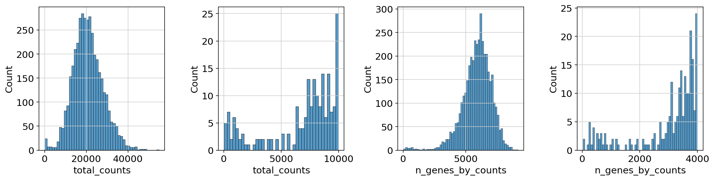 | 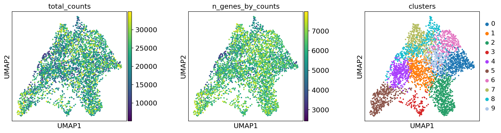 |
| *Total counts and gene count distributions per spot* | *UMAP embedding colored by counts and Leiden clusters* |

| Spatial Counts | Spatial Clusters |
|:---:|:---:|
| 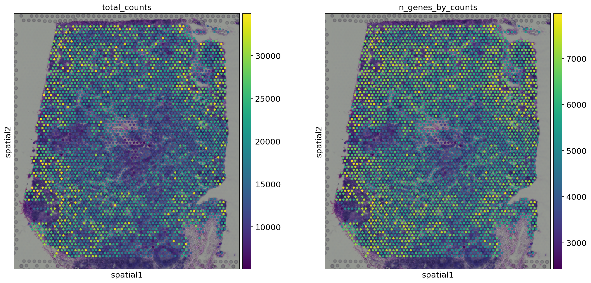 | 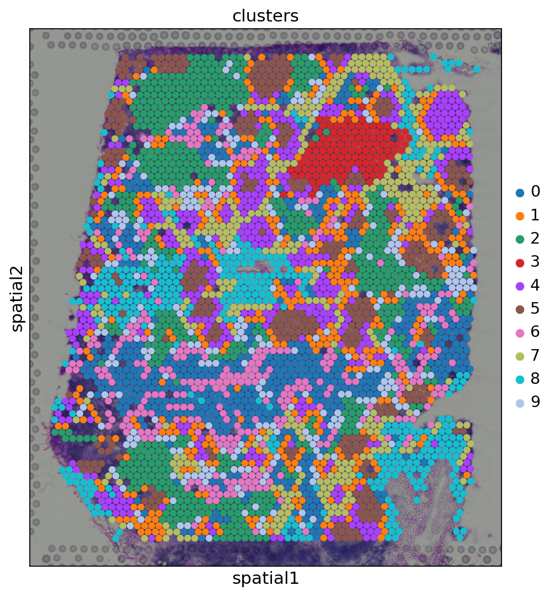 |
| *Total counts and genes overlaid on H&E tissue image* | *Leiden clusters overlaid on H&E tissue image* |

| Zoomed Clusters 5 & 9 | Marker Gene Heatmap |
|:---:|:---:|
| 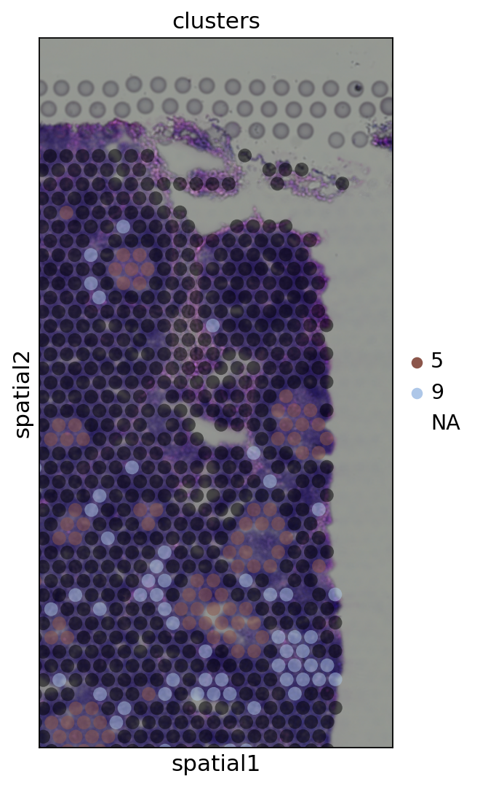 | 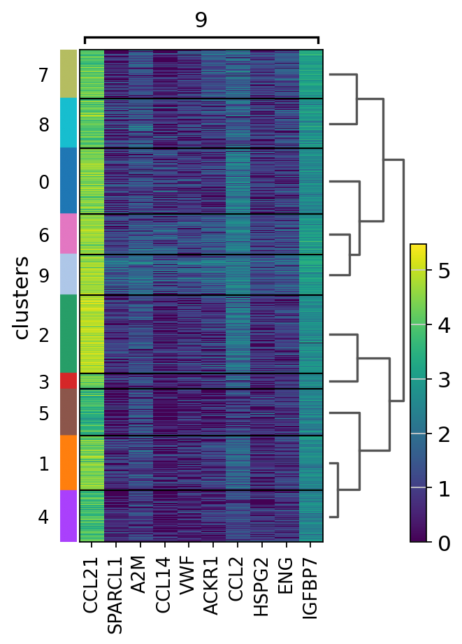 |
| *Cropped view of clusters 5 and 9 with semi-transparent spots* | *Top 10 marker genes for cluster 9 across all clusters* |

| Spatial CR2 Expression | Spatial COL1A2 & SYPL1 |
|:---:|:---:|
| 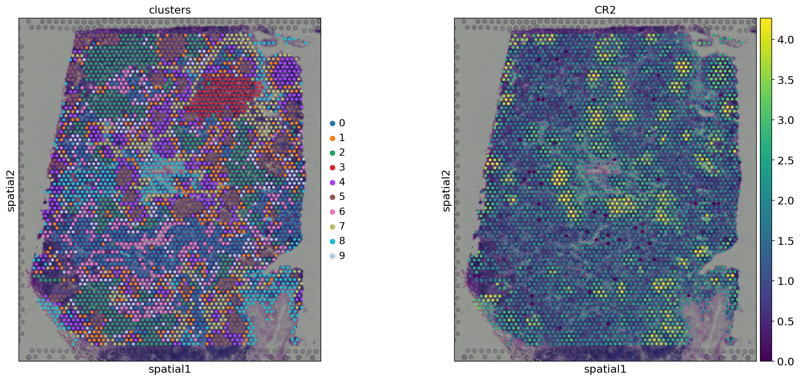 | 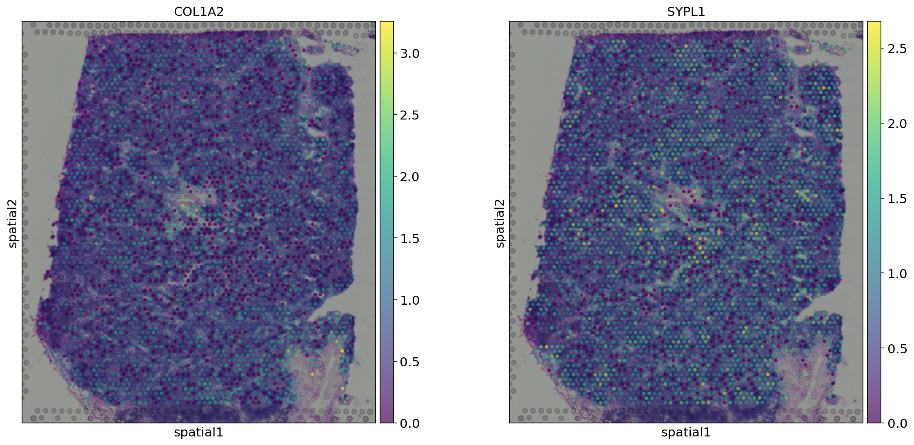 |
| *CR2 (B-cell marker) recapitulates cluster 9 spatial pattern* | *COL1A2 (stromal) and SYPL1 expression overlaid on tissue* |

> **Key Finding:** Leiden clusters align with known lymph node tissue structures. Cluster 9 is marked by CR2, a complement receptor expressed on mature B cells in follicles — confirming the biological validity of the clustering.

---

### Notebook 2 — Visium Fluorescence Image Analysis

**Dataset:** Mouse Brain — Visium with fluorescence image (pre-annotated)  
**Tools:** Scanpy, Squidpy, Pandas, AnnData

This notebook demonstrates **image feature extraction** from fluorescence Visium data. The fluorescence image has three channels: DAPI (nuclei), anti-NEUN (neurons), and anti-GFAP (glial cells). We segment nuclei using watershed, extract image features, and compare them to gene expression clusters.

#### Fluorescence Channels

| Channel | Marker | Biological Label |
|---|---|---|
| Channel 0 | DAPI | All cell nuclei (DNA staining) |
| Channel 1 | anti-NEUN | Neurons specifically |
| Channel 2 | anti-GFAP | Glial cells (astrocytes, oligodendrocytes) |

#### Pipeline

```
Fluorescence Visium Data
      │
      ▼
┌──────────────────────────┐
│  Load Data               │  sq.datasets.visium_fluo_image_crop()
│  View Channels           │  img.show(channelwise=True)
└───────────┬──────────────┘
            │
            ▼
┌──────────────────────────┐
│  Smooth Image (DAPI)     │  sq.im.process(method="smooth")
│  Watershed Segmentation  │  sq.im.segment(method="watershed")
└───────────┬──────────────┘
            │
            ▼
┌──────────────────────────┐
│  Segmentation Features   │  cell count, channel intensities
│  Summary Features        │  mean, std pixel intensities
│  Histogram Features      │  pixel intensity distributions
│  Texture Features        │  GLCM-based texture measures
└───────────┬──────────────┘
            │
            ▼
┌──────────────────────────┐
│  Cluster Image Features  │  PCA → Leiden on features
│  Compare to Gene Clusters│  sq.pl.spatial_scatter()
└──────────────────────────┘
```

#### Results

| Spatial Clusters (Gene-based) | Segmentation Comparison |
|:---:|:---:|
| 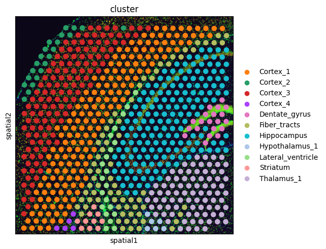 | 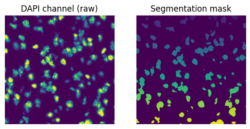 |
| *Pre-annotated brain region clusters in tissue space* | *Left: Raw DAPI — Right: Watershed segmentation mask* |

| Image Features vs Gene Clusters |
|:---:|
| 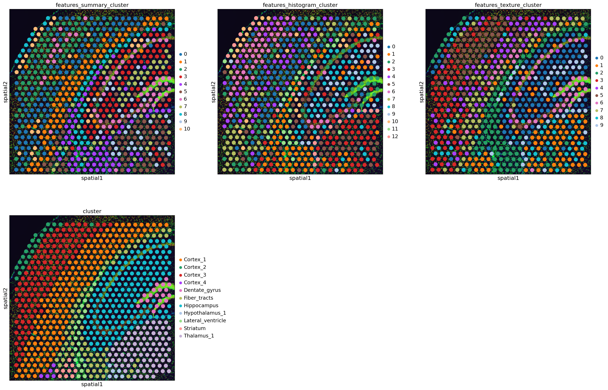 |
| *Summary, histogram and texture image clusters compared to gene-expression clusters* |

> **Key Finding:** Image feature clusters reveal finer resolution than gene clusters. The Hippocampus pyramidal layer shows higher cell density per spot — a distinction not visible in gene-space clustering alone.

---

### Notebook 3 — Visium H&E Spatial Graph Analysis

**Dataset:** Mouse Brain — Visium with H&E image (pre-annotated)  
**Tools:** Scanpy, Squidpy, NumPy, Pandas

This notebook focuses on **spatial graph statistics** — building a neighborhood graph and computing statistical measures of spatial organization across brain regions.

#### Spatial Statistics Explained

| Method | What it Measures | Output |
|---|---|---|
| **Neighborhood Enrichment** | Which clusters are spatially adjacent more than expected by chance | Z-score heatmap |
| **Co-occurrence** | How probability of seeing cluster B changes with distance from cluster A | Line plot vs distance |
| **Ligand-Receptor** | Candidate molecular communication between adjacent clusters | Dot plot |
| **Moran's I** | Whether a gene's expression is spatially organized or random | Ranked gene table |

#### Pipeline

```
Pre-annotated Mouse Brain H&E Visium
      │
      ▼
┌──────────────────────────┐
│  Extract Image Features  │  sq.im.calculate_image_features()
│  Cluster on Features     │  PCA → Leiden
└───────────┬──────────────┘
            │
            ▼
┌──────────────────────────┐
│  Build Spatial Graph     │  sq.gr.spatial_neighbors()
│  (connects adjacent spots│  → adata.obsp['connectivities']
│   by physical proximity) │
└───────────┬──────────────┘
            │
            ▼
┌──────────────────────────┐
│  Neighborhood Enrichment │  sq.gr.nhood_enrichment()
│  (n_perms=1000)          │  → z-score heatmap
└───────────┬──────────────┘
            │
            ▼
┌──────────────────────────┐
│  Co-occurrence           │  sq.gr.co_occurrence()
│  p(exp|cond) / p(exp)    │  → probability vs distance
└───────────┬──────────────┘
            │
            ▼
┌──────────────────────────┐
│  Ligand-Receptor         │  sq.gr.ligrec()
│  Moran's I               │  sq.gr.spatial_autocorr()
└──────────────────────────┘
```

#### Results

| Spatial Clusters (Brain Regions) | Neighborhood Enrichment |
|:---:|:---:|
| 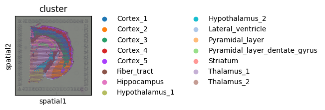 | 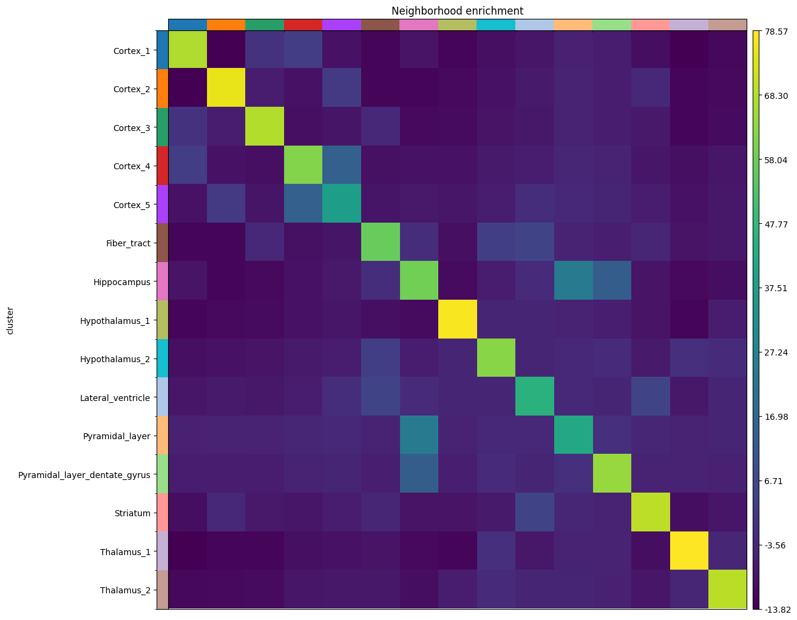 |
| *Pre-annotated mouse brain regions overlaid on H&E image* | *Z-score heatmap: warm = enriched neighbors, cool = depleted* |

| Co-occurrence from Hippocampus |
|:---:|
| 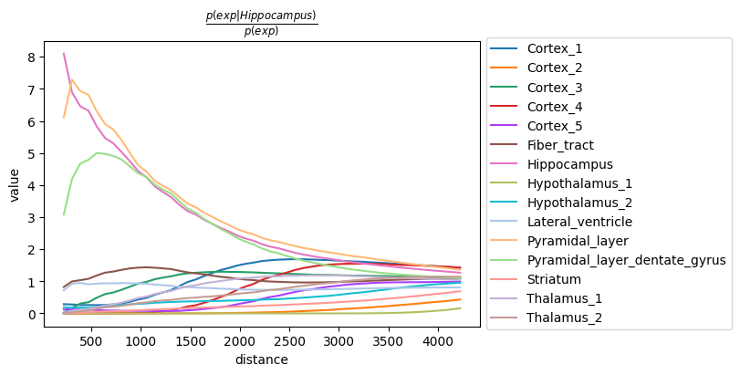 |
| *Co-occurrence probability of each cluster at increasing distances from the Hippocampus* |

> **Key Finding:** The Hippocampus shows high neighborhood enrichment with *Pyramidal_layer* and *Pyramidal_layer_dentate_gyrus* — these sub-regions are anatomically embedded within it. The co-occurrence plot confirms short-distance co-occurrence consistent with their known anatomy.

---

### Notebook 4 — Xenium Single-Cell Spatial Analysis

**Dataset:** Single-cell spatial dataset (Squidpy built-in)  
**Tools:** Scanpy, Squidpy, Seaborn, Matplotlib

This notebook demonstrates **single-cell resolution** spatial analysis. Unlike Visium, every row here is one individually segmented cell with its exact spatial coordinates. We compute spatial statistics at true cellular resolution.

#### Visium vs Single-Cell Resolution

```
VISIUM                          SINGLE-CELL SPATIAL (Xenium-style)
─────────────────────           ──────────────────────────────────
Each dot = one SPOT             Each dot = one CELL
  (~55µm, 5-30 cells)             (individually segmented)

[●] [●] [●] [●]       vs       [· · · · · · · · · ·]
[●] [●] [●] [●]                [· · · · · · · · · ·]
Coarser resolution              True single-cell resolution
```

#### Centrality Scores

| Score | What it Measures | High Value Means |
|---|---|---|
| **Closeness** | Average distance to all other cells | Cell type is centrally located |
| **Degree** | Fraction of other clusters connected | Cell type has many diverse neighbors |
| **Clustering coefficient** | How tightly neighbors cluster together | Cell type forms tight spatial communities |

#### Pipeline

```
Single-Cell Spatial Data
      │
      ▼
┌──────────────────────────┐
│  Load Data               │  sq.datasets.imc()
│  Calculate QC            │  sc.pp.calculate_qc_metrics()
│  Filter Cells & Genes    │  min_counts=10, min_cells=5
└───────────┬──────────────┘
            │
            ▼
┌──────────────────────────┐
│  Normalize Total         │  sc.pp.normalize_total()
│  Log Transform           │  sc.pp.log1p()
│  PCA + Neighbors         │  sc.pp.pca() + sc.pp.neighbors()
│  UMAP + Leiden           │  sc.tl.umap() + sc.tl.leiden()
└───────────┬──────────────┘
            │
            ▼
┌──────────────────────────┐
│  Spatial Graph           │  sq.gr.spatial_neighbors()
│  (Delaunay triangulation │  coord_type="generic"
│   for irregular coords)  │  delaunay=True
└───────────┬──────────────┘
            │
            ▼
┌──────────────────────────┐
│  Centrality Scores       │  sq.gr.centrality_scores()
│  Co-occurrence           │  sq.gr.co_occurrence()
│  Nhood Enrichment        │  sq.gr.nhood_enrichment()
│  Moran's I               │  sq.gr.spatial_autocorr()
└──────────────────────────┘
```

#### Results

| QC Histograms | UMAP Clusters |
|:---:|:---:|
| 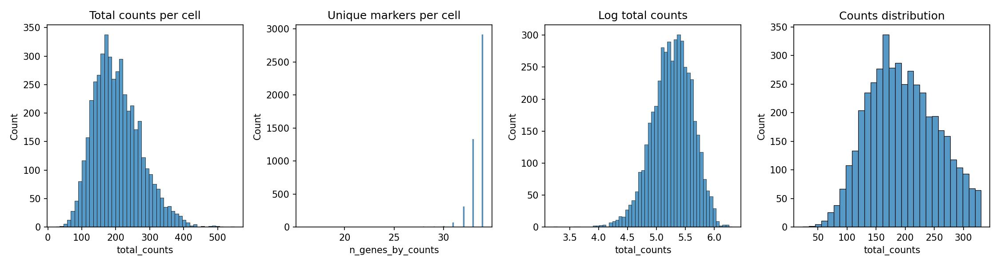 |  |
| *QC distributions: total counts and unique genes per cell* | *UMAP embedding colored by counts and Leiden clusters* |

| Spatial Clusters | Centrality Scores |
|:---:|:---:|
| 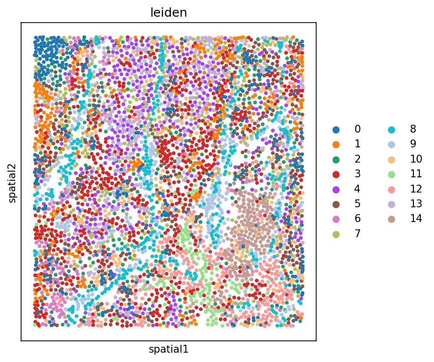 | 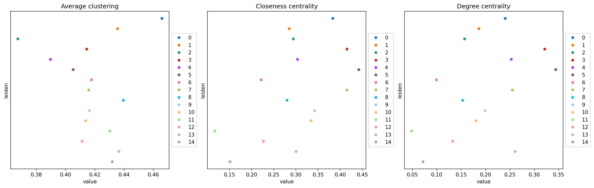 |
| *Leiden clusters at true single-cell resolution in tissue* | *Closeness, degree and clustering coefficient per cluster* |

| Co-occurrence | Neighborhood Enrichment |
|:---:|:---:|
| 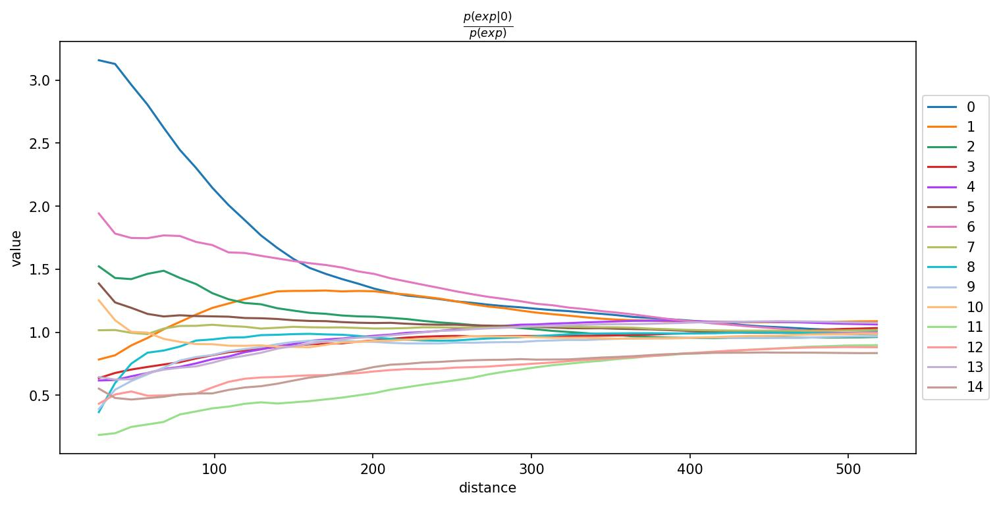 | 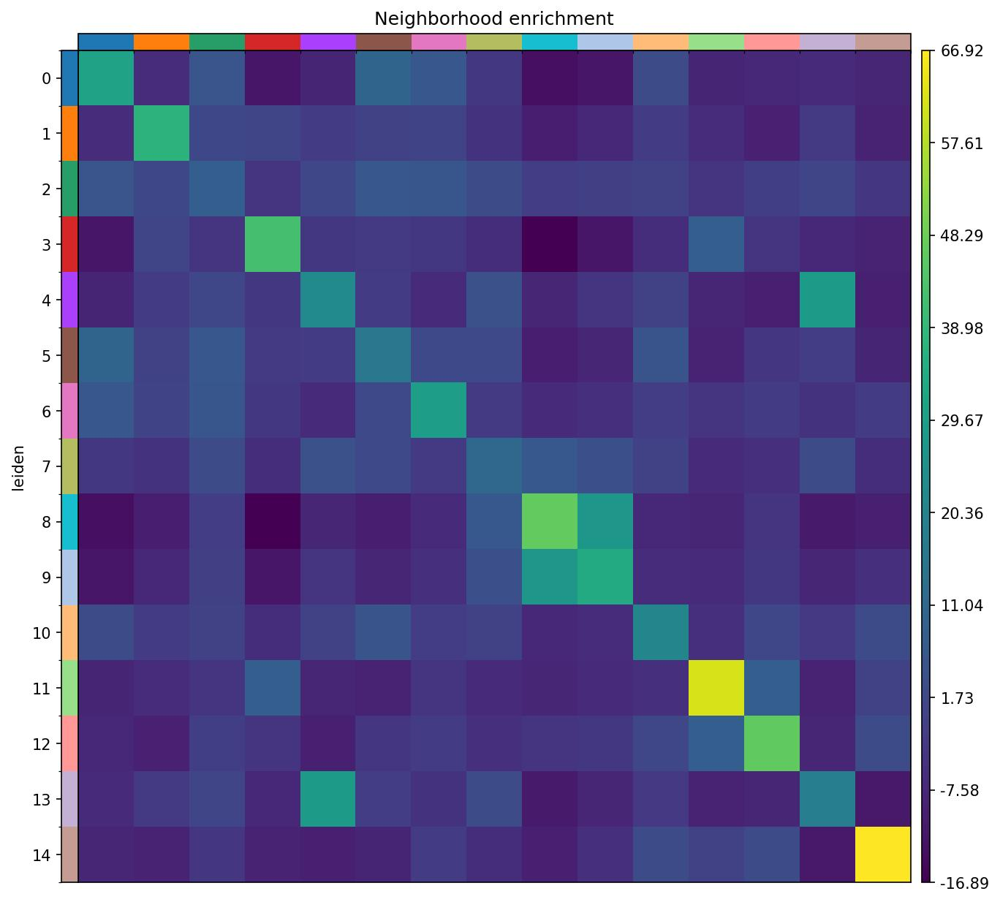 |
| *Co-occurrence probability from cluster 1 across distances* | *Z-score heatmap of cluster spatial adjacency* |

| Spatially Variable Genes (Moran's I) |
|:---:|
| 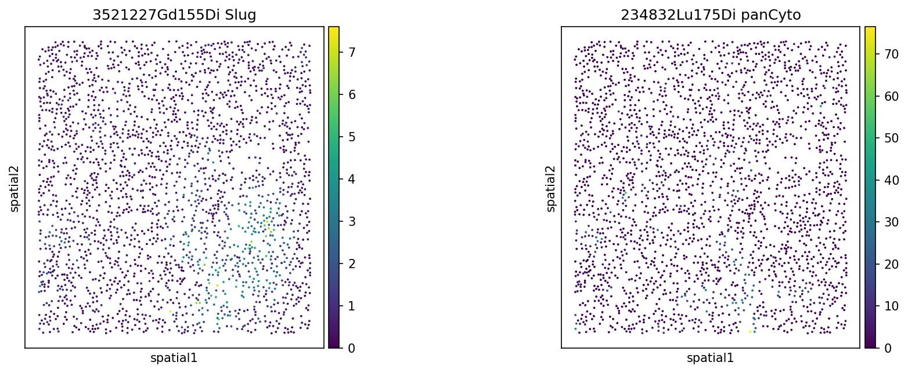 |
| *Top Moran's I genes showing spatially organized expression patterns in tissue* |

> **Key Finding:** Centrality scores reveal heterogeneous spatial roles of different cell clusters — some occupy the tissue core while others are peripheral. Top Moran's I genes show clear spatial organization, confirming that gene expression reflects underlying tissue architecture.

---

## 🛠️ Installation & Dependencies

### Notebooks 1, 2, 3
```bash
pip install scanpy squidpy igraph leidenalg scikit-image dask seaborn
```

### Notebook 4
```bash
pip install scanpy squidpy igraph leidenalg seaborn
```

---

## 🚀 Running the Notebooks

All notebooks were developed and tested on **Google Colab** (free tier).

```
1. Go to https://colab.research.google.com
2. File → Upload notebook → select .ipynb file
3. Add pip install cell at the top (see above)
4. Runtime → Run all  (Ctrl + F9)
```

> ⚠️ Some cells take several minutes (data download, UMAP, co-occurrence). This is expected behavior.

---

## 📚 Citations

1. Wolf et al. (2018) SCANPY: large-scale single-cell gene expression data analysis. *Genome Biology*. https://doi.org/10.1186/s13059-017-1382-0

2. Palla et al. (2022) Squidpy: a scalable framework for spatial omics analysis. *Nature Methods*. https://doi.org/10.1038/s41592-021-01358-2

3. Virshup et al. (2021) anndata: Annotated data. https://doi.org/10.1101/2021.12.16.473007

4. McInnes et al. (2018) UMAP: Uniform Manifold Approximation and Projection for Dimension Reduction. https://arxiv.org/abs/1802.03426

5. Traag et al. (2019) From Louvain to Leiden: guaranteeing well-connected communities. *Scientific Reports*. https://doi.org/10.1038/s41598-019-41695-z

---

## 🔗 Tutorial References

- [Scanpy Spatial Tutorial](https://scanpy-tutorials.readthedocs.io/en/latest/spatial/basic-analysis.html)
- [Squidpy Visium Fluorescence Tutorial](https://squidpy.readthedocs.io/en/stable/notebooks/tutorials/tutorial_visium_fluo.html)
- [Squidpy Visium H&E Tutorial](https://squidpy.readthedocs.io/en/stable/notebooks/tutorials/tutorial_visium_hne.html)
- [Squidpy Xenium Tutorial](https://squidpy.readthedocs.io/en/stable/notebooks/tutorials/tutorial_xenium.html)

---

*This repository was prepared as part of a Bioinformatics course assignment at NUST.*  
*All analyses were performed on Google Colab using publicly available datasets.*
